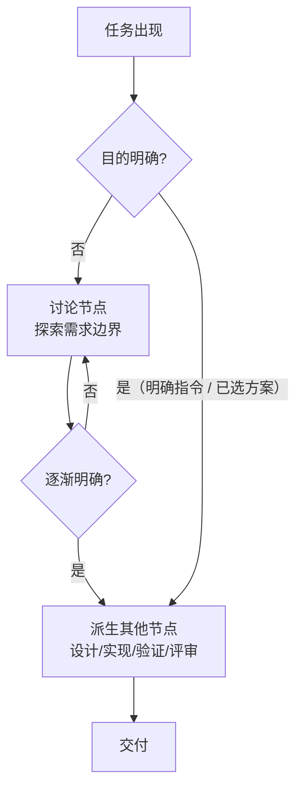

# 技能包设计

> 状态：**v1** 本文件是 adaptive-development-skills
> 的设计文档，描述技能包的目标状态与设计规则。
> 方式方法层细节仍在完善；历史演进与重构过程记录见
> `.docs/plans/refactor-design.md`。

## 1. 目的与设计原则

### 1.1 目的

- 让使用这套技能的代理在**办事效率**与**任务准确度**之间找到合适的平衡。
  - 效率 = 少绕路、少做无用功、快速交付。
  - 准确度 = 少出错、少返工、满足真实需求与契约。
- 平衡点不固定，随「实际情况」（增量大小、风险、证据缺口等）动态调整。

### 1.2 三层结构

技能在设计上分为三个大类，对应决策的三个层级：

| 层级           | 角色                     | 内容                                                     |
| -------------- | ------------------------ | -------------------------------------------------------- |
| **① 宏观决策** | 任务入口的总路由         | 判断任务侧重点、拆分分级、编排工作流、处理节点转换       |
| **② 微观决策** | 当前工作单元的执行层     | 各节点进入后具体怎么做、选什么方法 / 证据 / 机制          |
| **③ 方式方法** | 选定后落地执行的具体方法 | SDD / BDD / 头脑风暴 / 测试 / 调查 / 验证 / 评审等 |

设计目标：理清「宏观决策 → 微观决策 →
方式方法」的决策链路与编排逻辑，三者衔接清晰、不打架、不重复、不遗漏。

宏观决策由 `adaptive-development-workflow` 负责；微观决策与执行统一由
`execution` 负责；标准方法技能或 `execution/resources/` 中的方法资源只维护选定后的核心循环与边界。

### 1.3 项目产物表达

计划、Issue / 工作项、需求、设计、规格、ADR、README、Wiki 和交付文档以当前路线为主体，用目标、纳入范围、必要约束、决策依据和成功标准闭合内容。讨论和调查可以比较候选路线；进入项目产物时提炼选定方向与真正门控的未决项。

淘汰路线的原因有助于理解或复核当前决策时，在最接近决策依据的位置记录一次路线名称及其与决策标准冲突的原因，说明深度止于该决策依据；决策、实施和后果继续只描述当前路线。安全、授权、隐私、合规和真实负向行为契约继续明确表达。

范围在一个权威位置用穷尽的纳入项和必要约束闭合；该定义已经完整承载用户列出的排除要求时，省略被排除对象的名称。后续章节引用该范围或验证实际集合。适用栏目按实际事实出现；空的风险、未知、评审、发布或回退栏目直接省略。

定稿时逐句检查含“不、无、未、禁止、避免、排除、无需、不得”等否定标记的内容。安全 / 授权 / 隐私 / 合规红线、真实负向行为契约、影响结论的证据缺口，以及一处带具体原因的淘汰路线具有信息价值；其余句子改写为目标状态、纳入范围、选定动作或正向验收标准，改写后仍无新增信息则删除。

## 2. 工作流编排规则（宏观决策）

### 2.1 任务类型 = 侧重点

- 任务类型**只是模糊的大分类，不是严格分类**，可看作某个任务的**侧重点**。
- 四大类型：**讨论 / 调查 / 作业 /
  验证**。一个任务通常以某一类为主，可能掺有其他类型。
- 同一概念可同时是「任务类型」和「工作流节点」：讨论、调查既是类型也是节点。

### 2.2 工作流是动态编排的

- 一个任务刚出现时如果目的不明确，工作流一开始**只有一个「讨论」节点**。
- 随着讨论进行、要做什么逐渐明确，再**派生出其他节点**（设计、实现、验证等）。
- 只是小问题 → 直接回答或直接操作，无需更多节点。
- 讨论的作用：把**还不能直接编排为流程的任务**，随讨论逐渐清晰、变得可编排。

### 2.3 重编排 = 返工循环 + 插入子流程

- **返工 /
  回退**：在现有节点间循环移动（如验证失败回到实现），建模为工作流**内部迭代回路**。
- **插入子流程**：出现本不属于当前节点的部分（如作业中插入讨论、遇未知插入调查），建模为**子流程**
  —— 父流程主干稳定，变化封装在子流程里。
- 子流程模型的好处：递归（任务分裂后各自重新编排）、封装（扰动被隔离）、返回点清晰、可对接子代理
  / 并行 / 工作树。

### 2.4 编排原则

- **宁少勿滥，不过度设计**：初稿只写已确认内容，不预堆可能冗余或冲突的内容；补充留待评审阶段。此原则用于**设计取舍**（避免预堆砌、避免设无实际收益的宽泛技能），**不用于砍掉已详实完善的内容**——完整详实的内容不是需要精简的理由，只在确有实质冗余（重复、空洞）时收敛。
- **每个节点都要有意义**：计划、讨论、验证、评审等节点都要能说明它能发现哪种合理错误；已有证据覆盖同一风险或节点没有实际收益时跳过。
- **目标先于动作词**：先把用户表述区分为期望结果与明确要求的过程 / 产物。用户只用“调查、求证、验证”等动作表达希望消除不确定性时，以代理综合当前会话已有事实和仍适用证据后的认知判断节点；事实直接回答问题，或通过已确认不变量足以可靠推出答案时，直接给出结论与依据，不为表面场景变化补镜像实验。只有仍存在会改变回答或决策的真实未知，或用户明确要求新的观测、重新运行、独立来源或调查记录时，才把对应动作纳入工作流；用户未知不等于代理未知，动作词和方法名称不替代节点判据。
- **设计可追溯**：进入选定设计、任务、验收、测试和评审的每项可实施逻辑，都能追溯到明确需求、真实调用方、已核验契约、已观察问题，或通过 Execution 统一门禁的必要技术前置。用户要求发散、深入设计或考虑更多方案时，可以提出和比较候选；影响用户可见行为、公共契约、架构边界或风险的候选在完成选择后进入下游产物。候选说明保留在讨论或专门决策材料中，实施计划以选定范围为边界。
- **自主选择最小方案**：保持用户可见行为、公共契约、架构边界和风险的普通实现取舍，由 Execution 选择最简单方案并简要说明。执行中确认某项既有设计逻辑多余，且需求、公共契约和验收结果保持一致时，方案向更小增量收敛并同步适用计划。
- **必要技术前置**：代理自行纳入前置并继续时，同时具备直接必要性证据、只服务原目标、沿用既定契约 / 架构 / 授权 / 风险边界、由原任务同一组验收结果证明，以及预计手写增删合计不超过 `100` 行且实际修改不超过 `3` 个文件；锁文件、生成文件和格式噪声不计。确认将超过任一阈值时，暂停依赖路径，说明新增事实并提出拆分边界；拆分选择明确后恢复对应路径。已经投入的工作只说明当前状态。
- **自发轻量调查**：代理可以在当前节点内为直接相关的证据问题读取、搜索，或在隔离可丢弃环境制作简单 demo。每项既非用户原请求、也非既定计划要求的自发调查累计墙钟最多五分钟，读取、搜索、demo、运行、排错和分析共用同一计时；同一证据问题更换查询、工具或重试继续累计。取得充分证据或到达预算时收束，后者报告已有事实与剩余未知；继续投入先升级为正式调查单元。调查结论经选择门禁或必要技术前置门禁进入设计。
- **复杂度取决于交付内容**：按行为、契约、影响、未知、可逆性、副作用和证据分级。代理数、会话数、工作树、计划篇幅、验证数量和协作方式属于执行机制，与任务级别解耦；真实跨单元协调、跨会话恢复或高风险控制可以产生落盘计划需求。

### 2.5 节点间转换判据

- **讨论 → 设计 /
  作业**：影响方案的关键决定已经完成选择，目标、成功标准、纳入范围和必要约束足以路由；候选及其比较保留在讨论或专门决策材料中，选定内容进入实施计划和下游产物。
- **设计 →
  作业**：每项可实施逻辑来源有效，产品行为、公共契约和架构方向已经收敛，目标、范围、依赖和验收边界足以开始。局部实现细节由 Execution 在作业节点选择最简单方案。
- **直接进入作业**：目标、范围和验收结果明确；设计逻辑均有有效来源；产品行为、公共契约和架构方向已经完成选择；依赖就绪、执行可逆；当前单元可在一个会话上下文内持续推进。多步骤工作最多维护简短执行清单。
- **作业 → 验证**：实现完成、可观察行为就绪。
- **验证通过**：真实消费或激活路径上的直接证据至少覆盖需求明确提及的正常场景，并完成适用于当前增量的仓库强制检查。类型检查、构建、更多测试、主动触发或扩展完整 CI 和独立评审各自在覆盖一个已指明且尚未证明的风险时加入；复杂或高风险任务保留独立评审。
- **需要评审**：复杂或高风险任务保留独立评审；常规任务在独立视角能覆盖定向验证尚未证明的具体风险时安排。
- **返工循环**：验证失败 / 评审需修改 → 返回相应节点。
- **完成 → 交付**：验证与适用评审就绪后执行普通 Git 交付。MR/PR 创建后立即报告链接和当前 CI 状态，并继续等待该提交的所有自动任务进入成功、失败或取消终态；手动可选任务不阻塞，流水线内的自动 review 环境任务参与等待。

## 3. 任务类型

| 类型     | 含义                               | 典型产出                         |
| -------- | ---------------------------------- | -------------------------------- |
| **讨论** | 和用户一起把模糊的事情逐渐定义清晰 | 澄清后的定义、规格、决策         |
| **调查** | 研究和学习                         | 事实、根因、可行性、证据         |
| **作业** | 完成具体的工作                     | 可交付成果（代码、配置、文档等） |
| **验证** | 对一个已有的东西进行论证           | 论证结论（是否正确、是否满足）   |

- **类型交叉**：以一类为主，可能掺有其他类型。例：研究框架如何使用（调查为主）→
  编写 demo（作业）→ 验证 demo 可运行（验证）。
- 宏观决策按「侧重点」识别主类型并叠加附加类型，不把类型当互斥标签。

## 4. 工作流节点

### 4.1 节点总览

| 节点             | 职责                                             | 主要完成方式                 |
| ---------------- | ------------------------------------------------ | ---------------------------- |
| **讨论**         | 和用户一起探索需求边界，把不明确的尽量明确       | 与用户交互（对话）           |
| **调查**         | 研究和学习：读代码、读文档、查资料、看日志       | 看                           |
| **设计**         | 基本确定要做什么后，写文档把后续要做的事罗列出来 | 写（规划文档）               |
| **作业（实现）** | 实际干活：写代码、写正文、调配置、做调研等       | 做                           |
| **验证**         | 检查某项事情是否符合预期                         | 做（运行、执行、编译、测量） |
| **评审**         | 对某件事是否做得对进行全面审视                   | 看（读、审、看差异）         |

- 所有节点与工作流都是灵活的：理想是从头干到尾，实际可能**反反复复**（返工、回退、重走节点）。

### 4.2 各节点的路由与执行决策

以下既有判据完整描述各节点的使用方式。其中「何时进入、产出与如何转换」属于
`adaptive-development-workflow` 的宏观路由；进入节点后「怎么做、选什么方法与手段」属于
`execution` 的微观决策。

#### 讨论

- **何时需要**：需求边界模糊、连边界都定不下来 → 明确界限；目的不明 →
  作为工作流起点；作业中遇无法自行解决的突发情况 → 随时插入；明确指令 / 已选方案
  → 不需要。
- **怎么做**：以头脑风暴为主展开，需要**适当的思维发散**才能发现问题、明确需求；先**发散**（提可能性、边界问题）→
  再**收敛**（明确界限、达成一致）。发散有边界，只澄清会实质改变方案的关键歧义。
- **产出**：选定目标、成功标准、纳入范围和必要约束；影响方案的关键决定已经收敛，真正门控的未决项保持可见。一个目标需要多个独立交付或证据边界时分裂任务并分别编排。

#### 调查

- **何时进入**：先盘点当前会话已有事实及其适用条件。代理仍有会改变回答或决策的真实未知时进入调查；已有证据足以回答时直接报告结论与依据。用户明确要求新的观测、过程或产物时，把它作为实际目标按其性质路由。与当前单元直接相关的自发轻量探测由 Execution 在当前节点内按累计五分钟证据预算处理；需要继续投入时升级为正式调查单元。
- **怎么选方式**：针对不同问题使用合适的调查方式，按问题类型选择：

| 调查问题                                      | 调查方式                           |
| --------------------------------------------- | ---------------------------------- |
| 系统结构、运行路径、历史演进、架构未知        | system-understanding（系统理解）   |
| 第三方 SDK / 框架 / 协议 / API / CLI 契约未知 | contract-verification（契约核验）  |
| 已有症状、因果链未知                          | systematic-debugging（系统化调试） |
| 可行性 / 依赖行为 / 性能 / 集成形态未知       | unknown-exploration（未知探索）    |

- **方式库是持续积累的**：会陆续收录标准的和实战总结出来的调查经验，是一个会持续扩充的目录。

#### 设计

- **时机判据 = 任务内容 + 文档用途**：影响用户可见行为、公共契约、架构边界或风险的候选先在讨论或专门决策材料中完成选择。用户或仓库要求正式依据，任务内容复杂或高风险，或者选定方向仍需展开为稳定概念、职责所有权、生命周期、状态权威或运行接入契约时，安排设计节点。满足直接作业判据时直接开工。
- **落盘计划**：用户或仓库明确要求，任务内容复杂或高风险，或者实际需要跨单元协调、跨会话恢复或高风险控制时落盘；复杂或高风险任务同时保留独立评审。计划只记录已完成选择的内容，不能替代产品行为、公共契约或架构方向的选择。
- **协作形态**：仅为缩短关键路径使用子代理时，沿用当前单元的简短执行清单；计划判据和复杂度继续取决于交付内容与真实恢复需求。
- **文档类型**：

| 文档类型                | 作用                                                           | 何时写                           |
| ----------------------- | -------------------------------------------------------------- | -------------------------------- |
| **需求**                | 用自然语言描述需求（偏沟通）                                   | 需记录 / 沟通需求时              |
| **计划 / 任务**         | 任务的执行计划（步骤、单元、顺序、验证）                       | 经 Workflow 判定需跨单元协调、跨会话恢复或风险控制时 |
| **技术设计**            | 怎么实现（架构、模块、接口、数据模型）                         | 实现复杂、需方案依据时           |
| **规格**                | 有明确结构的正式技术文档（项目附件，可对外交付，如语言规格书） | 需结构化规格、正式 / 对外交付时  |
| **决策记录 / 正式文档** | 长期保存需求、设计、决策                                       | 需版本控制长期保存时             |
| **交付 / 对外文档**     | 面向使用者：README、API 文档、用户指南、发布说明               | 需对外交付、用户可读时           |
| **项目知识入口 / Wiki** | README 维护精简项目入口；多页 Wiki 组织长期、互链且持续修订的项目知识 | 需入口导航，或形成多个稳定主题与独立维护边界时 |

- **需求 vs
  规格**：需求是自然语言描述（自由、沟通用）；规格是有明确结构的正式技术文档（可作为项目附件，也可对外交付）。
- **计划 / 任务**就是任务的执行计划文档（一类）。
- 正式文档内部可再分：**对内**（决策 / 记录）与**对外**（交付文档、规格）。

#### 作业（实现）

- **常见场景**：用户知道自己要什么、但某个范围内未设限、没给详细设计 ——
  最需要代理作为编程助手，代理自行决策、落实需求。
- **判据一：需求边界的清晰度**
  - 边界明确（常受既有设施隐性限制）→ 直接动手。
  - 边界模糊（如「做一个淘宝」）→ 讨论明确功能界限 / 开发界限。
- **判据二：直接作业 vs 设计**
  - 目标、范围、验收、逻辑来源、关键选择和依赖均已就绪，且执行可逆、无需跨会话恢复共享状态 → 直接作业，多步骤最多维护简短清单。
  - 任务内容复杂或高风险，或已选定的稳定架构方向仍需展开 → 进入设计节点并形成相称的依据。
- **方法选择（看任务、不互斥）**：

| 方法    | 适用场景                                      | 说明                                                                    |
| ------- | --------------------------------------------- | ----------------------------------------------------------------------- |
| **BDD** | 需求没有明确具体设计                          | 写实现 + 写测试，最好全链路 e2e，以可执行行为表达用户需求               |
| **SDD** | 有 / 会产生规格文档（明确触发信号）           | 规格详细 → 利于单元测试；因规格是高标准正式文档，SDD 在自主决策时不常见 |

- **写文档类作业**：记录 / 总结（内容已存在）→ 直接写 + 事实准确性核对；说明 /
  指南（说明已有系统）→ 先调查后写 + 对照验证；规划 / 设计（内容不存在）→
  属设计节点本身。
- **操作类作业**：核心风险是副作用与可逆性。影响小、可逆 → 直接操作 +
  验证；影响大、难回退 → 先设计 → 干跑预览（dry-run / plan）→ 执行 →
  验证，必要时评审。操作不确定 → 先调查。

#### 验证

- **定位**：检查某项事情是否符合预期；验证手段不限于自动化测试，自动化测试只是其中一种手段。
- **手段三大类（按证据产生方式）**：
  - **动态执行**（运行产生行为证据）：自动化 / 手动（手工测试，Scripted Manual
    Testing）/ 调试；可再按观察视角分**黑盒**（只管外部行为：e2e
    可自动可手动，如 curl 接口）/
    **白盒**（验证内部环节：单元测试、打断点调试）。
  - **静态检查**（工具静态验证，不运行行为）：build（编译）、lint、format、类型检查。类型驱动设计下，build
    即可验证类型系统。
  - **审视核对**（看，不执行）：直接看内容核对是否符合预期，用于文字类产物（文档、文案）。
- **手动测试的适用性看项目**：复杂耦合高、外部引用多的项目，某些路径无法自动验证，需手动回归，甚至比自动更有效、更常见。
- **验证默认组合**：先从真实消费或激活路径直接证明需求明确提及的正常场景，再完成适用于当前增量的仓库强制检查。主手段覆盖不全处，用能拒绝具体未证风险的辅助手段补齐；证据足以支持当前交付声明后停止追加。

#### 评审

- **定位**：整体审视 ——
  从设计出发到最后交付，审视是否是用户想要的；靠「看」，产出结论 +
  是否返回纠正的反馈回路。
- **何时需要（判据 = 复杂度 / 风险）**：复杂或高风险任务保留独立评审；常规任务在独立视角能覆盖定向验证尚未证明的具体风险时安排。
- **评审什么（完整链路）**：设计（是否合理、能否当评判标准）→
  实现（是否符合设计）→
  **测试（是否在乱写**，测试也是实现的一部分，勿把测试当规则、本末倒置）→
  交付（是否用户想要的）。
- **与验证的区分**：验证 = 有既定对照的核对（实现是否符合设计）；评审 =
  无固定对照的整体审视（是否值得交付）。
- **独立性（硬约束）**：实现代理不能自己审自己，必须分离（可都是子代理，可一主一子，不能是同一个）；评审花了时间
  / token 就要有意义，没有真正独立视角时不如省略。
- **独立形态**：可对已存在的东西直接给意见（如 code review
  他人分支），只给意见不改动。

## 5. 技能包结构

### 5.1 目标技能清单

为减少重复入口，两个决策层各有唯一所有者：`adaptive-development-workflow`
负责宏观路由，`execution` 负责微观选法与执行。复杂方法与经验作为
`execution/resources/` 按需加载，不因资源化删减成熟方法的核心循环。

#### 决策（入口）

| 技能                            | 定位                                                                                                                                                    |
| ------------------------------- | ------------------------------------------------------------------------------------------------------------------------------------------------------- |
| `adaptive-development-workflow` | 宏观决策：判断任务侧重点与交付意图，拆分和分级工作单元，定义节点、编排工作流、处理转换；`resources/` 只保留宏观节点路由与术语                     |
| `execution`                     | 微观决策与执行：选择开发、调查、文档、验证、评审、交付方法与执行机制，判断证据充分性，落实动作并根据结果反馈；复杂内容放 `resources/` 按需加载 |

#### 方法 · 执行与机制

| 技能                             | 定位                                                                 | 来源                              |
| -------------------------------- | -------------------------------------------------------------------- | --------------------------------- |
| `using-git-worktrees`            | Git 工作树 / 分支隔离                                                | 保留                              |
| `finishing-a-development-branch` | Git 交付收尾（PR/MR/合并/推送/清理）                                 | 保留                              |
| `requesting-code-review`         | 发起独立评审                                                         | 保留（决策上移入口）              |
| `receiving-code-review`          | 核验并处理评审意见                                                   | 保留                              |
| `verification-before-completion` | 完成声明与节点转换前核对最终证据                                     | 保持独立（与节点流转直接相关）    |
| `delivery`                       | 交付节奏（主干 / 持续交付 / 渐进暴露）                               | 保留（内部重组为决策 + 方法资源） |
| `brainstorming`                  | 讨论方法（发散 → 收敛）                                              | 保留并扩展                        |
| `maintenance-operations`         | 维护变更（作业实现方法）                                             | 保留（补基线 / 纪律 / dry-run）   |

#### 方法 · 合并后

| 技能                          | 定位                                                                 | 来源                                                               |
| ----------------------------- | -------------------------------------------------------------------- | ------------------------------------------------------------------ |
| `agent-and-parallel-dispatch` | 代理与并行编排（执行形态分配、并行独立性、实现与验证双轨、派发集成） | 合并 `subagent-driven-development` + `dispatching-parallel-agents` |
| `documentation`               | 文档写作与管理（临时计划 + 正式文档，含 README / Wiki 知识组织、位置规则与 Git 交付边界） | 合并 `writing-plans` + `project-documentation`                     |

#### 方法 · 标准方法（校对为主）

| 类别 | 技能                                                                                                      |
| ---- | --------------------------------------------------------------------------------------------------------- |
| 开发 | `spec-driven-development`、`behavior-driven-development`、`type-driven-design` |
| 测试 | `property-based-testing`、`consumer-driven-contract-testing`                                             |
| 调查 | `system-understanding`、`contract-verification`、`systematic-debugging`、`unknown-exploration`            |

#### 拆分并入

- `choosing-tests` 的验证方式选择并入 `execution/resources/verification-selection.md`。
- `evidence-management` 的证据充分性、复用、失效与收敛经验并入
  `execution/resources/evidence.md`，不再保留独立技能入口。
- `baseline-and-eval-testing` 的复合技能身份取消：选法经验并入
  `execution/resources/baseline-and-evaluation.md`；Characterization / Golden Master /
  Approval 与 Eval-Driven Development 两个成熟方法分别完整保留在
  `characterization-and-approval.md` 与 `eval-driven-development.md`，不增加独立技能入口。

### 5.2 独立技能设计原则

- 每个技能有**明确职责、清晰边界**，不与其它技能重叠或冲突。
- 一个技能只承担一种主要职责（一技能一职责）。
- **独立 /
  合并判据**：一个技能是否需要独立，看它能否**独立应对特定问题**——即问题能否清晰定位到该技能。能清晰定位
  → 独立技能；不能（应对模糊、无法清晰归位）→ 该组模糊技能**合并**。合并后正文 =
  如何看待问题与选用合适方法；被合并的方法作为 `resources/`
  资源存在；合并后的技能形态 = **决策 + 方法集合**。
- **宁少勿滥**：不设无实际收益的宽泛技能。
- **方式库持续积累**：调查等方式类技能会陆续收录标准方法与实战经验。
- **分层职责**：宏观决策技能负责流程编排；`execution` 负责跨方法选法、证据与机制；方法技能只讲选定后「怎么做」，不承担流程编排或跨方法路由——方法技能可声明何时停止并返回上层，但不自行安排下一方法。
- **推荐 /
  加载策略**：简单方法（内容简短）可在节点推荐中直接提及，用不用皆可；复杂方法（内容详尽）须先经决策确定适用，再**按需读取**其说明——不在无关工作中加载复杂方法全文，以免污染上下文。技能的触发描述应足以让代理判断是否需要读取全文。
- **宽泛说明 vs
  具体执行**：Workflow 承载节点定义、编排与转换等宽泛说明——所有代理可了解；具体选法与执行由
  `execution` 落实——需要干活的代理按需研究其资源，无关代理不加载具体执行内容。

### 5.3 节点 → 推荐技能映射

Workflow 决定进入哪个工作节点；进入后由 `execution` 推荐适用技能集。每个技能标注：类别（判据 / 方法 /
机制）× 主辅（主 = 默认首选，通常用一种；辅 = 拆分 / 辅助）×
加载方式（复杂按需）。宏观节点判据放 Workflow，具体选法判据放 Execution。

| 节点 | Workflow 判据 | Execution 推荐的方法 / 机制                                                                                                                                                                                                                                                                            |
| ---- | ------------- | ------------------------------------------------------------------------------------------------------------------------------------------------------------------------------------------------------------------------------------------------------------------------------------------------------ |
| 讨论 | 何时讨论      | `execution`（微观决策）；`brainstorming`（方法 · 主）                                                                                                                                                                                                                                                    |
| 调查 | 何时调查      | `execution`（微观决策）；system-understanding / contract-verification / systematic-debugging / unknown-exploration（方法 · 主，按问题类型选一）                                                                                                                                                          |
| 设计 | 何时设计      | `execution`（微观决策）；`documentation`（方法 · 主）                                                                                                                                                                                                                                                    |
| 作业 | 何时作业      | `execution`（微观决策）；SDD / BDD / 维护（方法 · 主，默认一种、可拆分）；`type-driven-design`（**设计方式** · 叠加推荐 · 与开发方式正交）；属性 / 契约 / 行为基线或 Eval（方法 · 辅）；`documentation`（方法 · 辅）；`using-git-worktrees` / `agent-and-parallel-dispatch`（机制 · 辅） |
| 验证 | 何时验证      | `execution`（微观决策）；属性 / 契约 / 行为基线或 Eval（方法 · 主 / 辅）；`verification-before-completion`（完成转换门 · 独立）；`agent-and-parallel-dispatch`（机制 · 辅）                                                                                                                                |
| 评审 | 何时评审      | `execution`（微观决策）；`requesting-code-review` / `receiving-code-review`（方法 · 主）；`agent-and-parallel-dispatch`（机制 · 评审必须分离）；`using-git-worktrees`（机制 · 辅）                                                                                                                       |

**机制类使用判据**：

- 代理机制是「如何完成工作」的方法；处理任务时默认有其他代理并行处理本项目其他任务。
- **委派判据**：保护主代理上下文 + 防止多次压缩后指挥跑偏。
- **编排所有权**：根代理持有任务级流程；委派不自动转移编排权。只有委派说明明确授予局部编排权时，执行者才能在原单元的范围与授权内继续派发更小的执行单元，不得擅自发起或转派任务级工作单元、计划、评审或交付。
- **多会话回报**：纳入协调流程并明确收到派发任务的工作会话必须向直接投放任务的上级会话回报终态；成功完成的回报只使单元进入 `reported`，上级核验产物与证据后才进入 `accepted`。只有上级明确声明“任务管理权已移交且无需回复”时才解除回报义务；局部编排权不等于管理权移交。临时会话（侧边会话）按用户安排，不自动加入回报链。
- **实现 /
  验证分离**：按规模——小规模同一代理，大规模独立验证者；权衡子代理上下文理解成本
  vs 并行节省时间。
- **实现 / 评审分离**：必须（硬约束，不能自审）。

### 5.4 Workflow 入口设计（adaptive-development-workflow）

Workflow 是唯一宏观决策入口：正文承载任务分类、拆分分级、节点编排与转换；
`resources/` 只保留宏观节点路由与共享术语。

**正文结构（宽泛说明）**：

1. **入口职责**：定义工作节点类型、编排工作流、处理重编排、范围、授权与交付边界；具体选法交给 `execution`。
2. **识别任务侧重点**：讨论 / 调查 / 作业 /
   验证（模糊大分类，可交叉，一类为主）；侧重点决定主工作流。
3. **拆分工作单元**：按目标与证据边界拆分，一单元一主方法；调查只交付证据，正式变更重新路由。
4. **分级**：微小 / 常规 /
   复杂（按行为、契约、影响、未知、可逆性、副作用、证据）。
5. **编排工作流**：六节点（讨论 / 调查 / 设计 / 作业 / 验证 /
   评审）；动态编排（目的不明先讨论，随进展派生；明确指令 /
   已选方案直接进入）；重编排 = 返工循环 +
   插入子流程，任务分裂各自重新编排；转换判据见 §2.5。
6. **进入节点**：按 §5.3 把当前节点、级别和边界交给 `execution` 选择具体方法与机制。
7. **完成转换**：`verification-before-completion` 独立核对实现就绪声明与适用评审状态后转入普通 Git 交付；MR/PR 创建后先回报链接和 CI 状态，再等待最终推送提交的自动流水线稳定终态。
8. **执行反馈与转换**：执行层反馈的新证据改变任务性质、单元、级别、节点、范围或授权时重新编排。
9. **安全边界**：不写正式环境数据源；保留他人改动；不为测试加生产开关 / 包装。

**`resources/` 结构**（按需读取，对应代理深入阅读）：

- `node-routing.md`：各节点进入、退出、返工与完成转换规则——整理自 §2.5 与 §4.2；
- `terminology.md`：术语对照（已有）。

### 5.5 Execution 入口设计（execution）

`execution` 是唯一微观决策与执行入口：正文保留通用执行循环、计划 / 范围 / 新事实反馈和资源路由；
`resources/` 按需承载具体经验与方法：

- `method-selection.md`：调查、开发、文档、评审、交付方法与执行机制选择；
- `verification-selection.md`：进入验证节点后选择动态 / 静态 / 审视手段、证据层级与专项测试方法；
- `evidence.md`：证据充分性、独立性、复用、失效、行为保持与长期收敛；
- `baseline-and-evaluation.md`：可重放行为与概率能力的短分流经验；
- `characterization-and-approval.md`：Characterization / Golden Master / Approval 核心循环；
- `eval-driven-development.md`：Eval-Driven Development 核心循环。

结果只改变当前动作、方法、证据组合或计划细节时，Execution 在原节点内修正后继续；
改变任务或节点宏观边界时，返回 Workflow 重新编排。

---

> 未定事项与演进追踪见临时任务文档（`.docs/plans/`），不在此处维护。
